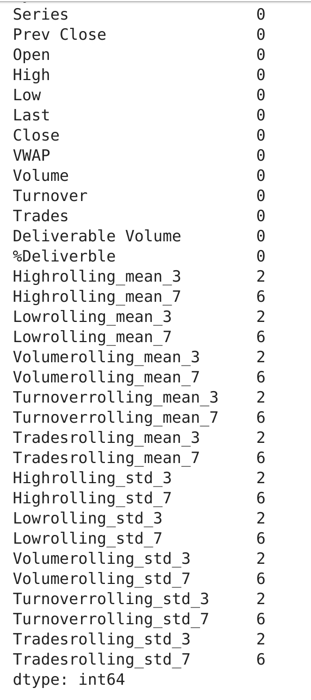
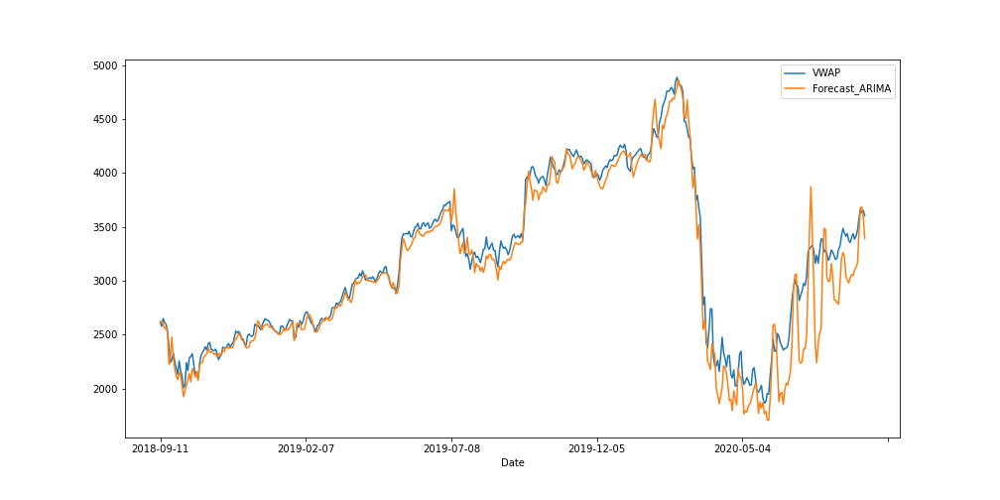

# Project 8 Predict Stock Prices using Time Series Analysis

1. [Importar librerías ](#schema1)

# 1. Importar librerías, cargar los datos

~~~python
import pandas as pd
import numpy as np

df=pd.read_csv('./data/BAJFINANCE.csv')
df.head()
~~~

# 2. Trazado de la variable  VWAP.
~~~python
df['VWAP'].plot()
plt.savefig("./images/VWAP.png")
~~~

# 3. Procesamiento de los datos

Borramos los datos que contienen valores nulos, ya que tenemos `df.shape` de `(5070, 14)`
~~~python
df.isna().sum()

Symbol                   0
Series                   0
Prev Close               0
Open                     0
High                     0
Low                      0
Last                     0
Close                    0
VWAP                     0
Volume                   0
Turnover                 0
Trades                2779
Deliverable Volume     446
%Deliverble            446

df.dropna(inplace=True)
~~~
Hacemos una copia de los datos para trabajar con ellos
~~~python
data=df.copy()
~~~

# 4. Rellenar con datos, usando la función rolling

~~~python
lag_features=['High','Low','Volume','Turnover','Trades']
window1=3
window2=7

for feature in lag_features:
    data[feature+'rolling_mean_3']=data[feature].rolling(window=window1).mean()
    data[feature+'rolling_mean_7']=data[feature].rolling(window=window2).mean()

for feature in lag_features:
    data[feature+'rolling_std_3']=data[feature].rolling(window=window1).std()
    data[feature+'rolling_std_7']=data[feature].rolling(window=window2).std()
~~~
~~~python
data.isna().sum()
~~~

Borramos todos los nulos.

~~~python
data.dropna(inplace=True)
~~~
Creamos `training_data`y `test_data`
~~~python
training_data=data[0:1800]
test_data=data[1800:]
~~~

# 5. Aplicar Auto-Arima en datos

~~~python
conda install -c conda-forge pmdarima
~~~
Importamos auto_arima y creamos el modelo
~~~python
from pmdarima import auto_arima
model=auto_arima(y=training_data['VWAP'],exogenous=training_data[ind_features],trace=True)
Best model:  ARIMA(0,0,0)(0,0,0)[0] intercept
~~~
Entrenamos el modelo
~~~python
model.fit(training_data['VWAP'],training_data[ind_features])
~~~
Predicción
~~~python
forecast=model.predict(n_periods=len(test_data), exogenous=test_data[ind_features])
test_data['Forecast_ARIMA']=forecast
test_data[['VWAP','Forecast_ARIMA']].plot(figsize=(14,7))
~~~

# 6. Evaluación del modelo de series de tiempo

Comprobación de la precisión de nuestro modelo
~~~python
from sklearn.metrics import mean_absolute_error, mean_squared_error
np.sqrt(mean_squared_error(test_data['VWAP'],test_data['Forecast_ARIMA']))
187.78457864989696
mean_absolute_error(test_data['VWAP'],test_data['Forecast_ARIMA'])
124.65743209627183
~~~