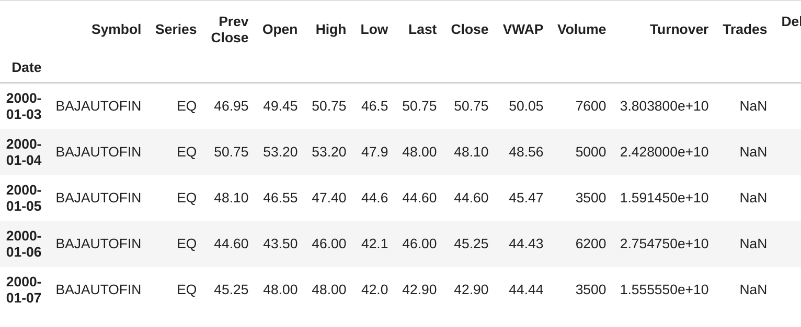
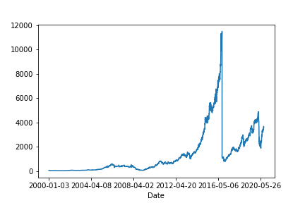

# Project 8 Predict Stock Prices using Time Series Analysis

1. [Importar librerías ](#schema1)

# 1. Importar librerías, cargar los datos

~~~python
import pandas as pd
import numpy as np

df=pd.read_csv('./data/BAJFINANCE.csv')
df.head()
~~~

# 2. Trazado de la variable  VWAP.
~~~python
df['VWAP'].plot()
plt.savefig("./images/VWAP.png")
~~~

# 3. Procesamiento de los datos

Borramos los datos que contienen valores nulos, ya que tenemos `df.shape` de `(5070, 14)`
~~~python
df.isna().sum()

Symbol                   0
Series                   0
Prev Close               0
Open                     0
High                     0
Low                      0
Last                     0
Close                    0
VWAP                     0
Volume                   0
Turnover                 0
Trades                2779
Deliverable Volume     446
%Deliverble            446

df.dropna(inplace=True)
~~~
Hacemos una copia de los datos para trabajar con ellos
~~~python
data=df.copy()
~~~